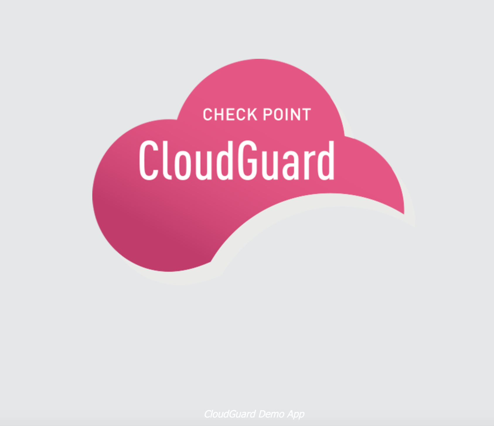

# Deploy a GKE Cluster in 5 minutes 
Here is a couple of scripts that automate deploying Kubernetes cluster (GKE) on Google Cloud Platform. You could use automation tools like Terraform to do this but this is just another way of automating the same thing. Whether you're doing a quick test or demo, you can use this very simple shell script to deploy a GKE cluster in 5 minutes, and clean it up in about 3 minutes. Basically, one script to create a cluster with a demo app, and another script to clean up.

You will need to have an account on Google Cloud Platform and should have created a project. 

 1. [gke_setup.sh](https://github.com/jaydenaung/gkelab/blob/master/gke_setup.sh) 
 2. [cleanup_cluster.sh](https://github.com/jaydenaung/gkelab/blob/master/cleanup_cluster.sh)

### gke_setup.sh

This is the script that builds a GKE cluster. The script will create the following:

1. A GKE cluster
2. A Deployment
3. A service (Load balancer)

Before executing the script, please update the following values in the script:

 ``` bash
 #UPDATE THIS with your GCP Project Name
PROJECT_ID="YOUR_PROJECT_NAME"

 #UPDATE THIS with the location of Docker Image of your choice
IMAGE="gcr.io/$PROJECT_ID/your-docker-image:v1"
 ```

 And basically execute the script, and provide the following when the script prompts:

 - Your Cluster name (Default is my-cluster)
 - App Name (Default is demo-app)
 - GCP Region (Default is asia-southeast1)
 - Your Kubernetes service name (Default is my-service)


 ```bash
 ./gke_setup.sh
 ```

 ### Sample Output

 ```bash
$ ./gke_setup.sh 
Enter Your Cluster Name (Default: my-cluster): 
Enter App Name (Default: demo-app): 
Enter GCP Region (Default: asia-southeast1): 
Enter Your Service Name (Default: my-service): 
Creating Cluster on GCP in 
WARNING: Warning: basic authentication is deprecated, and will be removed in GKE control plane versions 1.19 and newer. For a list of recommended authentication methods, see: https://cloud.google.com/kubernetes-engine/docs/how-to/api-server-authentication
WARNING: Currently VPC-native is not the default mode during cluster creation. In the future, this will become the default mode and can be disabled using `--no-enable-ip-alias` flag. Use `--[no-]enable-ip-alias` flag to suppress this warning.
WARNING: Newly created clusters and node-pools will have node auto-upgrade enabled by default. This can be disabled using the `--no-enable-autoupgrade` flag.
WARNING: Starting with version 1.18, clusters will have shielded GKE nodes by default.
WARNING: Your Pod address range (`--cluster-ipv4-cidr`) can accommodate at most 1008 node(s). 
Creating cluster chkp in asia-southeast1... Cluster is being health-checked (master is healthy)...done.                                                     
Created [https://container.googleapis.com/v1/projects/helloworld041019/zones/asia-southeast1/clusters/chkp].
To inspect the contents of your cluster, go to: https://console.cloud.google.com/kubernetes/workload_/gcloud/asia-southeast1/chkp?project=helloworld041019
kubeconfig entry generated for chkp.
NAME  LOCATION         MASTER_VERSION   MASTER_IP      MACHINE_TYPE   NODE_VERSION     NUM_NODES  STATUS
chkp  asia-southeast1  1.16.13-gke.401  1.2.3.4  n1-standard-1  1.16.13-gke.401  6          RUNNING
chkp has been created.
Creating deployment..
deployment.apps/cyberave-io created
Scaling deployment to 3 replicas..
deployment.apps/cyberave-io scaled
Configuring autoscaling for the deployment..
horizontalpodautoscaler.autoscaling/cyberave-io autoscaled
Exposing your app via a load balancer..
service/cyberave-svc exposed
Your Kubernetes cluster has been created!
Your load balancer IP is 1.2.3.4

 ```
Now you have a working cluster! Note down the ***Load Balancer's IP*** and access it on the browser. At this point, you should see the demo app.



If you want to do a simple security posture assessment, on your cluster [check this out](#How-about-a-security-posture-assessment?) before you run cleanup script to delete your cluster. 

-----
### cleanup_cluster.sh

This is the script that deletes and cleans up GKE clusters. The script will basically delete deployments, and services before deleting the cluster itself.

Execute the script:

```bash
echo "Y" | ./cleanup_cluster.sh
```

Note: Add ```echo "Y" |``` before the script to auto-answer Yes to a prompt.

### Sample Output

> When it asks whether you want to ***Continue***, Enter "Y".

```bash
 echo "Y" | ./cleanup_cluster.sh 
Now we are gonna do a clean up!
You have a service called demo-svc
Now we are gonna delete demo-svc ..
service "demo-svc" deleted
demo-svc has been deleted..
You have a deployment called demo-app ..
Now we are gonna delete demo-app
deployment.apps "demo-app" deleted
demo-app has been deleted..
Now we are gonna delete the GKE clusters..
You have a GKE cluster called my-cluster..
Now we are gonna delete my-cluster..
The following clusters will be deleted.
 - [my-cluster] in [asia-southeast1]

Do you want to continue (Y/n)?  y

Deleting cluster my-cluster...done.                                                                                           
Deleted [https://container.googleapis.com/v1/projects/helloworldxxxx/zones/asia-southeast1/clusters/my-cluster].
Clean-up has been completed on Wed Oct 21 16:48:49 +08 2020..


```

# How about a security posture assessment?

Once you've deployed your cluster, I'd strongly recommend that you check out my article on [how to run a security posture assessment on your Kubernetes cluster using CloudGuard CSPM.](https://medium.com/@jaydenaung/securing-kubernetes-environments-with-check-point-cloudguard-cspm-ea23e69d5f7c)

You can even automate onboarding of Kubernetes clusters to CloudGuard CSPM using [python and bash scripts that I've developed](https://github.com/jaydenaung/cloudguardk8s)

Thanks.

Happy DevSecOps-ing,\
Jayden Aung
